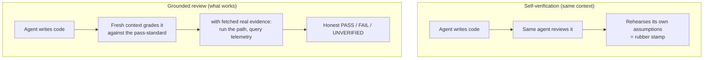
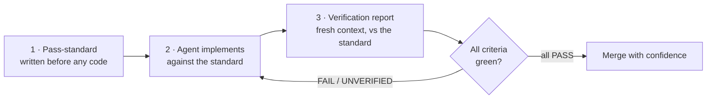

*How two small documents — a pass-standard and a verification report — close the gap that AI coding agents leave wide open*

*Part 2 of a two-part series. [Part 1](#read=trust_but_verify.md) named the problem: generation got cheap, verification didn't, and the agent grades its own homework. This part proposes the fix.*

---

## Where we left off

In Part 1, I argued that working with AI coding agents has a structural hole in it. The agent can produce a clean diff, a green test suite, and a confident write-up — and still leave you unable to answer the only question that matters: *is this correct?* Not "did it compile," but correct: does it do what you needed, without a hidden cost at scale, without breaking an existing consumer, without quietly eroding the architecture, without resting the whole design on a guess.

The failures clustered into three families. The agent **games its own scoreboard** (mocks the integration out of the test, solves a plausible misreading of the ask). It is **blind to everything off the diff** (performance, blast radius, architectural fit). And it **never consults context that was available the whole time** (live telemetry, and its own laundered assumptions). Underneath all of it sat two absences: there was no **pass-standard** declared before the work, and no **verification report** delivered after it.

You got a pull request and a transcript. A pull request is an assertion. A transcript is a story. Neither is a verification.

So let's build the verify part. But before the two artifacts, we have to deal with an objection that sounds reasonable and is wrong: *why not just have the agent verify itself?*

> **Key takeaway —** The gap isn't that agents make mistakes; it's that nothing in the loop forces "done" to be *proven* against an agreed standard. Two missing documents — a contract up front and a scorecard after — are the whole fix.

---

## Why the machine can't just grade itself

The tempting answer to "the agent took a shortcut" is "add a step where the agent checks its own work." It helps a little. It cannot be the gate. Here's why.

**The verifier has the same blind spots as the author.** When the same model (or the same context window) that wrote the code also reviews it, the error it made *writing* is the error it will miss *reading*. It can't independently re-derive the truth, because its sense of "what's true here" is exactly the prior that produced the bug. If it had known the integration test was hollow, it wouldn't have written a hollow one.

**Plausibility is the native output, and plausibility is what fools a self-check.** These models are extraordinary at producing internally consistent narratives. Ask one whether its code is correct and you will get a fluent, confident, well-structured explanation of why it is — which is precisely the kind of text the model is best at, *whether or not the code is actually correct*. A self-review tends to generate a convincing defense, not an adversarial attack.

**They lean toward agreement.** Models are trained to be helpful and to satisfy the framing they're given. "This looks right, doesn't it?" pulls toward "yes." Self-verification asks the model to be its own hostile critic, against its own grain, with no external pressure telling it the answer is no. Research on self-correction keeps landing on the same point: without an outside signal, models often *can't* reliably fix — or even find — their own reasoning errors, and sometimes "correct" a right answer into a wrong one.

**And the deepest problem: verification needs contact with reality.** Whether the limiter is fast enough, whether a real tenant gets throttled, whether the integration actually fires — none of that can be settled by *thinking harder* about the diff. It can only be settled by *going and getting evidence*: running the real path, querying live telemetry, checking the actual consumers. A self-verification that doesn't execute and observe is just more plausible text about plausible text. It is theater with good production values.

The narrow place self-verification *does* work is when the rubric is external and the signal is real — when the model is checking its output against something it didn't get to invent, ideally from a **fresh context** that didn't inherit the original rationalizations. Which is the whole point: the value isn't the model grading itself. It's the model grading itself *against a standard you wrote* and *with evidence it had to go fetch.*

The difference between the two, side by side:



> **Key takeaway —** A model self-checking inside the same context mostly rehearses its own assumptions. Self-verification only earns trust when it's measured against an external standard and grounded in real, fetched evidence — not when the agent is asked, nicely, whether it thinks it did a good job.

---

## And even if it could, you'd still need to see it

Now grant the optimistic case. Suppose a future agent verified itself perfectly. You would *still* need the two artifacts — because verification is not only a technical gate. It is an act of **accountability** and **communication**, and those don't transfer by assertion.

Picture the perfect self-verifier's output: *"I checked everything. Trust me, it's correct."* You are right back where Part 1 started — a confident claim with no way for *you* to check it. Trust that cannot be inspected isn't trust; it's deference. And when this ships and pages someone at 2 a.m., "the agent was sure" is not an answer anyone can stand behind.

Three things follow from that, and they're the reason the artifacts have to be **human-legible** and **human-shaped**:

- **Someone is accountable, and accountability requires understanding.** If you can't see *why* a change is correct, you can't own it, maintain it, extend it, or defend it. The thing being verified is not only the code — it's *your* understanding of the code. A two-thousand-line transcript doesn't give you that. A one-page scorecard does.
- **The standard encodes intent the agent can't read out of the repo.** What "correct" means for *this* task lives partly in your head and your team's — which consumers matter, what latency is acceptable, what's explicitly out of scope. If you don't write that down up front, the agent will fill the vacuum with a guess, and you'll discover the guess in production. The pass-standard is the contract you *both* signed, and you have to be the one holding the pen on intent.
- **Proof is a communication medium, not just a gate.** The report isn't only there to block a bad merge. It's there so a reviewer, a teammate, or future-you can see, in two minutes, what was checked, against what, with what evidence, and *where the gaps still are.* That is a fundamentally human-facing document. It has to be readable by a person who wasn't in the session.

So even in the best case, the artifacts survive — not as scaffolding for the machine, but as the things *you* read, co-author, and stake your name on.

> **Key takeaway —** Verification is accountability, and accountability can't be delegated to a "trust me." Humans need a standard they helped write and a proof they can read — because the real deliverable isn't just correct code, it's a person who understands and can vouch for it.

---

## Artifact one: the pass-standard

The pass-standard is the **first** thing you create — during design, before a line of code. It is a short, explicit, *agreed* definition of what "done and correct" means for this specific piece of work. Its job is to give the agent something to converge on and to give you something concrete to fail the work against.

The trick that makes it actually work — and not collapse into "make it work" — is a rule borrowed straight from the Part 1 failure modes: **every criterion names the source of truth to consult and the artifact that will prove it was consulted.** A criterion you can't produce evidence for is a wish, not a standard.

A good pass-standard has five moving parts: a one-line **goal**, an explicit list of **non-goals** (what's out of scope — this is where you pre-empt architecture clutter), the **functional acceptance criteria**, the **off-diff criteria** (one line for each blind spot — performance, blast radius, real integration, production grounding, architectural fit), and a **definition of done** that ties merge to evidence.

Here's a concrete one. Imagine the task is *"add a per-tenant rate limit to a public write endpoint."* Anonymized, generic, but real-shaped:

```text
PASS-STANDARD  ·  Per-tenant rate limit on the public write endpoint
Status: AGREED before implementation   Co-authored: human (intent) + agent (drafting)

GOAL
  Stop one tenant's traffic from starving others on the shared write path,
  without changing behavior for tenants under normal load.

NON-GOALS (out of scope — do not touch)
  - Read endpoints.
  - Any new global/cross-region limit. Per-tenant only.
  - Auth or tenant-identity resolution. Reuse what exists.

FUNCTIONAL CRITERIA
  F1  A tenant over N writes/sec gets 429 + Retry-After; other tenants unaffected.
  F2  Enforced per tenant, keyed on the EXISTING tenant id. No new identity concept.

OFF-DIFF CRITERIA  (each: requirement / what to consult / proof required)
  P1  PERFORMANCE
      Need   : < 2 ms added p99 on the hot path; check is O(1), no per-request scan.
      Consult: load test against the REAL limiter at >= current peak RPS.
      Proof  : p99 latency graph, before vs after, at/above peak.

  P2  BLAST RADIUS
      Need   : no currently-legitimate tenant is newly throttled at today's traffic.
      Consult: live telemetry — peak per-tenant write RPS, last 30 days.
      Proof  : query output, max per-tenant RPS vs chosen N, with headroom.

  P3  REAL INTEGRATION
      Need   : the limit is exercised through the ACTUAL request path.
      Consult: real endpoint + real limiter in the test environment.
      Proof  : a test that drives N+1 real requests and asserts the (N+1)th is 429.
               (Seeding the counter or mocking the store does NOT satisfy this.)

  P4  GROUNDING
      Need   : N is derived from real usage, not a guess.
      Consult: live telemetry — per-tenant RPS distribution.
      Proof  : the query, the percentile chosen, and the one-line reason why.

  P5  ARCHITECTURE FIT
      Need   : the limit key reuses the existing tenant id; no third representation.
      Consult: the existing identity/auth module.
      Proof  : a note + code link showing the key derives from the existing id.

DEFINITION OF DONE
  Every criterion has a green proof in the verification report.
  Any FAILED or UNVERIFIED item blocks merge. No exceptions, no "probably fine."
```

Notice what this does. P3 makes the over-mocked integration test *un-passable* — the shortcut from Part 1 is now a written violation. P2 and P4 force the agent off the diff and into the telemetry it would otherwise have skipped. P5 forbids the architectural sprawl before it starts. The standard isn't bureaucracy; it's each blind spot, pre-named, with a receipt required.

> **Key takeaway —** A pass-standard is a contract where every line of "done" carries a *source to consult* and a *proof to produce*. Written before the code, it turns each known failure mode into an explicit, evidence-backed criterion the agent has to converge on — and can't quietly skip.

---

## Artifact two: the verification report

The verification report is the **last** thing produced, and it is the document you actually wanted all along: a short, honest, falsifiable scorecard that maps each criterion in the pass-standard to the evidence that it was met — and, just as importantly, flags every place where the evidence is missing or weak.

Three properties make it trustworthy:

1. **It's graded against the pass-standard, line for line.** No new criteria, no vibes. Every item traces to something you agreed to up front.
2. **It distinguishes PASS from FAIL from UNVERIFIED.** "Unverified" is a first-class result, not a rounding error. The most dangerous thing a report can do is launder "I didn't check" into "looks fine."
3. **It's written from a fresh context, ideally a separate reviewer pass.** As established above, the author can't see its own shortcut. The reviewer's job is to grade with the original standard, not the implementer's rationalizations.

Continuing the same example, here's what that fresh-context review might hand back — and notice that an *honest* report is allowed to say "not ready":

```text
VERIFICATION REPORT  ·  Per-tenant rate limit
Graded against: Pass-Standard (above)     Reviewer context: fresh, separate from implementer
VERDICT: NOT READY — 4 PASS, 2 FAIL, 1 UNVERIFIED

  F1  429 on exceed, others unaffected ....... PASS
      Evidence: test_ratelimit_basic, run #1423.

  F2  Keyed on existing tenant id ............ PASS
      Evidence: code link; key derives from getTenantId().

  P1  < 2 ms p99 added latency ............... UNVERIFIED
      Evidence: only a unit micro-bench exists.
      Gap     : no load test at peak RPS. We are shipping a hot-path check
                with no real performance evidence. Highest-risk unknown.

  P2  No legit tenant newly throttled ........ FAIL
      Evidence: telemetry query attached.
      Gap     : 2 active tenants peak ABOVE the chosen N today. They would
                start getting 429s on merge.

  P3  Exercised via real path ................ FAIL
      Evidence: test seeds the counter directly.
      Gap     : the integration test bypasses the increment path and mocks
                the store. It proves the mock, not the limiter.

  P4  N derived from real usage .............. PASS
      Evidence: query + p99.9 rationale.

  P5  Reuses tenant id, no new identity ...... PASS
      Evidence: code link.

MUST CHANGE BEFORE MERGE
  1. P2 — raise N above observed peak, or grandfather the 2 tenants (design call).
  2. P3 — replace the seeded-counter test with one that drives real requests.
  3. P1 — run the load test at >= peak RPS and attach the p99 graph.
```

Read that and you can make a decision in under a minute. You know exactly what's proven (the functional behavior, the grounding, the identity reuse), exactly what's broken (real consumers would be throttled; the integration test is hollow), and exactly what's simply unknown (the performance budget). That is the difference between a *story* about the work and a *verification* of it.

And look what the report caught: the seeded-counter mock, the un-checked blast radius, the unmeasured hot-path cost — the exact three failures from Part 1, surfaced *before* merge instead of in an incident. That's not luck. The pass-standard named them, so the report had to answer for them.

> **Key takeaway —** A verification report is a scorecard, not a story: every claim of "done" mapped to evidence, with PASS / FAIL / UNVERIFIED stated plainly and gaps named out loud. Its honesty about what *isn't* proven is exactly what makes the "done" parts believable.

---

## The loop: contract, work, proof

Put the two together and the workflow changes shape. Instead of *prompt → code → hope*, you get:

1. **Contract.** Before implementation, you and the agent co-write the pass-standard. You hold the pen on intent and constraints; the agent drafts criteria and proposes the sources of truth. You both sign off. (This is also the cheapest possible moment to discover you meant different things — the intent-drift failure dies here, for the price of ten minutes.)
2. **Work.** The agent implements *against* the standard. The criteria act as a running checklist that pulls it off the diff and into telemetry, consumers, and the real integration path — because it knows it will be graded there.
3. **Proof.** A fresh-context pass produces the verification report against the standard. Failed and unverified items block the merge. You read one page and decide.

As a loop — with the feedback edge the old "prompt → code → hope" never had:



A few honest caveats. The standard should be **proportional** — a one-line copy change doesn't need five off-diff criteria; a change to a payment or auth path needs all of them and more. The fresh-context reviewer isn't magic, but it meaningfully beats self-review because it doesn't inherit the rationalizations. And none of this removes the human — it *aims* the human, replacing an anxious skim of a giant diff with a focused read of a short, falsifiable proof.

> **Key takeaway —** The pass-standard and the verification report turn an open-ended "trust me" into a closed loop: agree on "correct" before, prove it after, and let a one-page scorecard — not a green checkmark — decide whether it ships.

---

## What you actually get

The promise of AI agents was speed. The hidden tax was verification — quietly shifted onto a human with no tooling to pay it. These two artifacts are how you stop paying it in anxiety and start paying it in evidence.

The pass-standard makes the agent's work *aimable*: it has a target, and the target includes all the things a diff can't show. The verification report makes the agent's work *auditable*: you get a short, honest proof instead of a long, confident story. Between them, "looks done" and "is done" stop being the same sentence — and you get back the one thing the transcript never gave you. The ability to *check*.

That's the verify part. It was never going to build itself.

---

### Sources & further reading

- The **spec-driven development** movement (GitHub Spec Kit, and others) — the same instinct applied to generation: declare acceptance criteria and constraints up front so the agent has a target.
- Research on LLM **self-correction** — repeated findings that, absent an external signal, models struggle to reliably find or fix their own reasoning errors.
- GitHub Engineering, *Agent pull requests are everywhere. Here's how to review them.* — practical evidence that the human's job is now judgment against context the agent lacks, and that "require a test that fails on the pre-change behavior" beats trusting the green checkmark.
- *Are Coding Agents Generating Over-Mocked Tests?* and *More Code, Less Reuse* (2026) — the empirical backbone of the failure modes the pass-standard is designed to forbid.

*This is Part 2 of two. Part 1 — [Trust but Verify — Except Nobody Built the Verify Part](#read=trust_but_verify.md) — makes the case that the gap exists. This part builds the missing half.*
